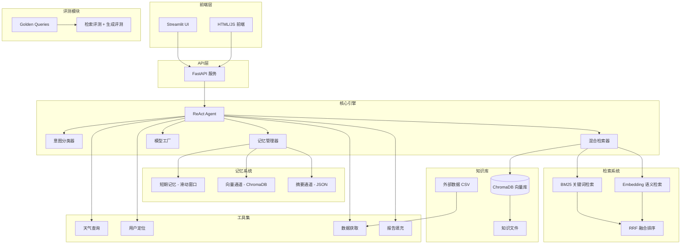
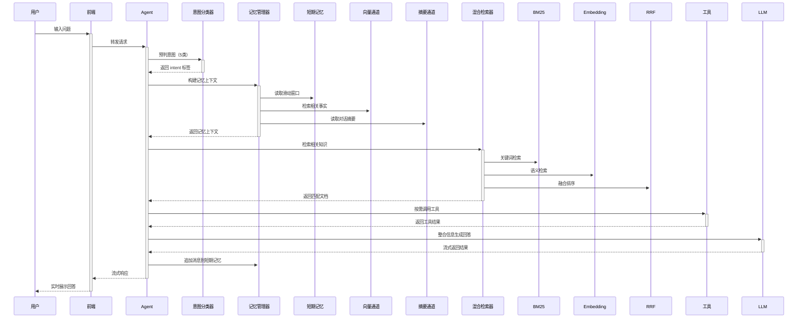

<p align="center">
  
  
  
  
  
  
</p>

<h1 align="center">智扫通机器人智能客服</h1>
<p align="center"><b>SmartSweep — 基于 LLM + RAG + Agent 的扫地机器人智能问答系统</b></p>

<p align="center">
  智能问答 · 混合检索 · 意图识别 · 记忆系统 · 报告生成 · 多工具集成 · 流式响应 · 全链路评测
</p>

---

## 项目简介

**智扫通**是一个面向扫地机器人领域的智能客服系统，融合了**大语言模型（LLM）**、**检索增强生成（RAG）**与**智能体（Agent）**三大核心技术，能够根据用户问题结合知识库信息提供准确、专业的回答。

系统支持**多轮对话**（短期滑动窗口 + 长期双通道记忆）、**意图预判**（5 类意图自动识别）、**流式输出**、**报告生成**等功能，并集成了天气查询、用户定位、外部数据获取等多种工具，为用户提供全方位的智能客服体验。

### 适用场景

- 🏠 扫地机器人 **选购咨询**（户型匹配、功能对比）
- 🔧 扫地机器人 **故障排查**（故障代码解读、解决方案）
- 📋 扫地机器人 **维护保养**（耗材更换、清洁建议）
- 📊 扫地机器人 **使用报告**（月度使用数据分析）

---

## 系统架构



### 核心流程



---

## 核心功能

### 1. 智能问答
基于 RAG 技术，从知识库中检索相关信息，结合大模型生成精准回答。

### 2. 意图预判
基于规则 + 关键词的轻量意图分类器，在 Agent 执行前完成意图识别，动态切换提示词与工具集。

| 意图 | 标签 | 说明 |
|------|------|------|
| 咨询问答 | `qa` | 一般性产品问题、使用建议（默认） |
| 故障排查 | `troubleshoot` | 错误码、故障现象、异常处理 |
| 维护保养 | `maintenance` | 耗材更换、清洁保养、定期维护 |
| 报告生成 | `report` | 使用报告、数据统计、使用记录查询 |
| 选购推荐 | `purchase` | 选购建议、户型匹配、功能对比 |

优先级：`troubleshoot > report > maintenance > purchase > qa`

### 3. 记忆系统
采用**短期记忆（滑动窗口）** + **长期记忆（双通道）** 的分层记忆架构：

| 通道 | 存储方式 | 机制 |
|------|----------|------|
| 短期记忆 | 内存消息列表 | 滑动窗口（10 轮），超出时自动触发双通道处理 |
| 向量通道 | ChromaDB | 事实提取 → Hash 精确去重 → Embedding 语义去重 → 权重衰减排序 |
| 摘要通道 | JSON 文件 | LLM 压缩对话为摘要，持久化存储 |

**权重衰减**：半衰期 7 天，指数衰减，权重 < 0.1 时视为过期。

### 4. 混合检索
检索策略采用 **BM25 关键词检索** + **Embedding 向量检索** + **RRF 融合排序**：

| 通道 | 技术 | 特点 |
|------|------|------|
| BM25 | rank_bm25 + jieba 分词 | 捕获精确关键词匹配（如 "E4 错误码"） |
| Embedding | text-embedding-v4 | 捕获语义相关（如 "扫地机卡住" → "缠绕故障"） |
| RRF 融合 | Reciprocal Rank Fusion (k=60) | 消除单一通道偏差，综合排序 |

### 5. 多工具集成
| 工具 | 功能 | 说明 |
|------|------|------|
| `rag_summarize` | RAG 知识检索 | 从向量库检索扫地机器人相关资料 |
| `get_weather` | 天气查询 | 获取指定城市天气信息 |
| `get_user_location` | 用户定位 | 获取用户所在城市 |
| `get_user_id` | 用户识别 | 获取用户 ID |
| `get_current_month` | 时间获取 | 获取当前月份 |
| `fetch_external_data` | 外部数据获取 | 从 CSV 获取用户使用记录 |
| `fill_context_for_report` | 报告上下文填充 | 触发报告场景的提示词切换 |

### 6. 流式响应
采用 SSE（Server-Sent Events）协议，实现逐字输出效果，提升交互体验。

### 7. 报告生成
系统能根据用户的扫地机器人使用记录（特征、效率、耗材、对比等维度），自动生成使用报告。

### 8. 全链路评测
支持检索阶段和生成阶段的自动化评测：

| 阶段 | 指标 | 说明 |
|------|------|------|
| 检索 | Recall@K | top_k 文档中命中期望关键词的比例 |
| 检索 | HitRate@K | top_k 中是否至少命中 1 个关键词 |
| 检索 | MRR | 第一个命中关键词的文档排名 |
| 检索 | NDCG@K | 排序质量（靠前命中得分更高） |
| 生成 | Faithfulness | 回答是否包含检索到的关键词 |
| 生成 | Answer Relevancy | 回答是否与问题相关 |

### 9. 双模式部署
- **Streamlit 模式**：快速启动，适合演示与调试
- **FastAPI 模式**：RESTful API，支持自定义前端，适合生产部署

---

## 技术栈

| 层级 | 技术 | 说明 |
|------|------|------|
| 🎨 前端 | **Streamlit** / **HTML + JavaScript** | 交互界面与可视化 |
| ⚙️ 后端 | **Python 3.10+** | 核心业务逻辑 |
| 🧠 大模型 | **通义千问 (qwen-plus)** | 自然语言理解与生成 |
| 🧩 智能体框架 | **LangChain ReAct** | 智能体推理与工具调用 |
| 📚 向量数据库 | **ChromaDB** | 知识库存储与语义检索 |
| 🔗 文本嵌入 | **text-embedding-v4** | 文本向量化 |
| 🔍 关键词检索 | **BM25 (rank_bm25) + jieba** | 精确关键词匹配 |
| 🔗 融合排序 | **RRF (Reciprocal Rank Fusion)** | 多通道结果融合 |
| 🌐 API 服务 | **FastAPI + Uvicorn** | RESTful 接口与流式响应 |
| ⚙️ 配置管理 | **YAML** | 模块化参数配置 |

---

## 快速开始

### 环境要求

- Python 3.10+
- pip 21.0+
- 通义千问 API 密钥

### 1. 克隆项目

```bash
git clone <repository-url>
cd Aagent_zhisaotong
```

### 2. 安装依赖

```bash
pip install -r requirements.txt
```

### 3. 配置 API 密钥

```bash
# Windows (CMD)
set DASHSCOPE_API_KEY=your_api_key_here

# Windows (PowerShell)
$env:DASHSCOPE_API_KEY="your_api_key_here"

# Linux / macOS
export DASHSCOPE_API_KEY=your_api_key_here
```

也可在项目根目录创建 `.env` 文件：

```env
DASHSCOPE_API_KEY=your_api_key_here
```

### 4. 配置文件说明

项目主要通过 `config/` 目录下的 YAML 文件进行配置：

| 配置文件 | 用途 | 关键参数 |
|----------|------|----------|
| `rag.yml` | RAG 模型配置 | `chat_model_name`, `embedding_model_name` |
| `agent.yml` | 智能体配置 | `external_data_path` |
| `chroma.yml` | 向量数据库配置 | `collection_name`, `k`, `chunk_size`, `chunk_overlap` |
| `prompts.yml` | 提示词路径配置 | 各场景 prompt 文件路径 |

---

## 使用指南

### 启动方式一：Streamlit 模式（推荐体验）

```bash
streamlit run app.py
```

访问 `http://localhost:8501`，在聊天框输入问题即可。

### 启动方式二：FastAPI 模式（生产部署）

```bash
# 方式1：命令行
uvicorn fastapi_main:app --reload --port 8001

# 方式2：直接运行
python fastapi_main.py

# 方式3：使用 run_server.py（推荐，自动加载 .env）
python run_server.py
```

#### API 接口

| 方法 | 路径 | 说明 |
|------|------|------|
| `GET` | `/` | 返回前端聊天页面 |
| `POST` | `/chat` | 流式聊天接口（SSE） |
| `POST` | `/chat/sync` | 同步聊天接口 |
| `POST` | `/session/end` | 结束会话（触发长期记忆保存） |
| `GET` | `/health` | 健康检查接口 |

#### 接口调用示例

```python
import requests
import json

# 流式聊天
url = "http://localhost:8001/chat"
response = requests.post(url, json={"query": "小户型适合哪些扫地机器人？", "user_id": "user_1001"}, stream=True)

for line in response.iter_lines():
    if line:
        line = line.decode("utf-8")
        if line.startswith("data: "):
            data = json.loads(line[6:])
            print(data["content"], end="", flush=True)

# 同步聊天
url = "http://localhost:8001/chat/sync"
response = requests.post(url, json={"query": "如何保养扫地机器人？", "user_id": "user_1001"})
print(response.json()["response"])

# 结束会话（保存长期记忆）
url = "http://localhost:8001/session/end"
response = requests.post(url, json={"user_id": "user_1001"})
print(response.json())
```

### 问答示例

```
Q: 小户型适合哪些扫地机器人？
A: 根据资料，小户型建议选择以下类型的扫地机器人：
   - 机身轻薄（<10cm），便于进入低矮家具底部
   - 尘盒容量适中（300-400ml），足以应对日常清洁
   - 支持边角清扫功能，提高覆盖率
   ...

Q: 生成我的月度使用报告
A: 为您生成2025年3月的使用报告：
   - 清扫特征：每日定时清扫，覆盖面积提升
   - 清洁效率：较上月提升15%
   - 耗材状态：边刷建议更换，滤网正常
   - 本月对比：综合评分 A
   ...
```

### RAG 评测

```bash
python -m eval.rag_eval
```

需要先确保知识库已加载（启动过一次项目即可）。评测结果示例：

```
Recall@5     = 0.9300 (93.0%)
HitRate@5    = 0.9800 (98.0%)
MRR          = 0.8200
NDCG@5       = 0.8700
Faithfulness = 0.8500 (85.0%)
```

---

## 项目结构

```
Aagent_zhisaotong/
├── agent/                         # 智能体模块
│   ├── react_agent.py             # ReAct 智能体核心实现（集成记忆系统）
│   ├── intent_classifier.py       # 意图分类器（规则+关键词，5类意图）
│   ├── memory_manager.py          # 记忆管理器（短期窗口 + 长期双通道）
│   ├── memory_extractor.py        # 事实提取（LLM提取 + Hash去重）
│   ├── vector_memory.py           # 向量通道（ChromaDB + 权重衰减 + TTL）
│   ├── summary_memory.py          # 摘要通道（LLM压缩 + JSON持久化）
│   └── tools/
│       ├── agent_tools.py         # 工具定义（RAG/天气/定位等7个工具）
│       └── middleware.py          # 中间件（监控/日志/意图提示词切换）
├── config/                        # 配置管理
│   ├── agent.yml                  # 智能体配置（外部数据路径）
│   ├── chroma.yml                 # 向量数据库配置（集合/分块参数）
│   ├── prompts.yml                # 提示词文件路径配置
│   └── rag.yml                    # RAG 模型配置（模型名称）
├── data/                          # 数据与知识库
│   ├── external/                  # 外部数据（CSV格式使用记录）
│   ├── memory_store.json          # 摘要通道持久化文件
│   ├── 故障排除.txt               # 故障排除知识
│   ├── 维护保养.txt               # 维护保养知识
│   └── 选购指南.txt               # 选购指南知识
├── eval/                          # RAG 评测模块
│   ├── golden_queries.json        # 黄金测试集（50条查询+期望关键词）
│   └── rag_eval.py                # 评测脚本（Recall/HitRate/MRR/NDCG/Faithfulness）
├── model/                         # 模型层
│   └── factory.py                 # 模型工厂（ChatTongyi + DashScopeEmbeddings）
├── prompts/                       # 提示词模板
│   ├── main_prompt.txt            # 通用客服提示词
│   ├── troubleshoot_prompt.txt    # 故障排查工程师提示词
│   ├── maintenance_prompt.txt     # 维护保养顾问提示词
│   ├── purchase_prompt.txt        # 选购顾问提示词
│   ├── report_prompt.txt          # 报告写手提示词
│   └── rag_summarize.txt          # RAG 总结提示词
├── rag/                           # 检索增强生成
│   ├── hybrid_retriever.py        # 混合检索器（BM25 + Embedding + RRF 融合）
│   ├── rag_service.py             # RAG 服务（检索 + 生成）
│   └── vector_store.py            # 向量存储服务（ChromaDB + MD5去重）
├── utils/                         # 工具模块
│   ├── config_handler.py          # YAML 配置加载
│   ├── file_handler.py            # 文件读写处理（TXT/PDF加载）
│   ├── logger_handler.py          # 日志记录
│   ├── path_tool.py               # 路径解析
│   └── prompt_loader.py           # 提示词文件加载
├── static/                        # 静态资源
│   └── index.html                 # FastAPI 模式前端页面
├── chroma_db/                     # ChromaDB 持久化存储
├── logs/                          # 运行日志
├── app.py                         # Streamlit 应用入口
├── fastapi_main.py                # FastAPI 应用入口（含完整注释）
├── main.py                        # FastAPI 精简入口
├── run_server.py                  # 服务器启动脚本（自动加载 .env）
├── requirements.txt               # 项目依赖
└── README.md                      # 项目说明
```

---

## 核心模块详解

### 1. 智能体模块 (`agent/`)

**ReAct Agent** 是系统的核心决策引擎，采用 LangChain 的 ReAct（Reasoning + Acting）模式：

- **推理**：分析用户问题，决定调用哪些工具及调用顺序
- **行动**：按序调用工具获取信息（知识检索、天气、用户数据等）
- **观察**：整合工具返回的结果
- **回答**：基于所有信息生成最终回答

**意图分类器**（`intent_classifier.py`）：
- 基于规则 + 关键词的轻量意图预判
- 支持 5 类意图：qa / troubleshoot / maintenance / report / purchase
- 关键词匹配（权重 ×1）+ 正则匹配（权重 ×2）
- 在 Agent 执行前完成，注入 `context["intent"]` 供中间件使用

**中间件机制**（`middleware.py`）：
- `monitor_tool` — 工具调用监控与日志记录，调用 `fill_context_for_report` 后标记 `context["report"]`
- `log_before_model` — 模型调用前日志记录
- `intent_prompt_switch` — 基于意图分类的动态提示词切换（优先级：report > intent > 默认）

### 2. 记忆系统 (`agent/memory_*.py`)

**记忆管理器**（`memory_manager.py`）统一管理短期记忆和长期记忆：

```
用户消息 → 追加到滑动窗口 → 检查是否超出（10轮/20条）
  ├─ 未超出：正常执行 Agent
  └─ 超出：对旧消息做双通道处理 → 丢弃旧消息 → 保留最近10轮
```

**事实提取**（`memory_extractor.py`）：
- 用 LLM 从对话中提取关键事实（用户信息、偏好、需求等）
- Hash 精确去重（MD5）+ Embedding 语义去重（余弦相似度 > 0.85）
- 每条事实控制在 30 字以内

**向量通道**（`vector_memory.py`）：
- 事实向量化存入 ChromaDB（独立 collection `long_term_memory`）
- 半衰期 7 天，权重指数衰减
- 检索时按权重排序，低于阈值（0.1）的记忆自动过滤
- 支持会话结束时清理过期记忆

**摘要通道**（`summary_memory.py`）：
- 用 LLM 将对话压缩为 200 字以内的摘要
- 持久化存入 `data/memory_store.json`
- 每次新摘要追加并合并

### 3. RAG 模块 (`rag/`)

实现检索增强生成（Retrieval-Augmented Generation）流程：

```
用户问题 → 混合检索（BM25 + Embedding）→ RRF 融合 → 获取相关文档 → 拼接上下文 → LLM生成回答
```

**混合检索器**（`hybrid_retriever.py`）：
- **BM25 通道**：jieba 分词 → BM25Okapi 倒排索引，捕获精确关键词匹配
- **Embedding 通道**：text-embedding-v4 向量化 → ChromaDB 相似度检索，捕获语义相关
- **RRF 融合**：`RRF_score(d) = Σ 1/(k + rank_i(d))`，k=60，消除单一通道偏差
- **自动刷新**：检测 ChromaDB 文档数变化时自动重建 BM25 索引

**向量存储**（`vector_store.py`）：
- ChromaDB 作为向量数据库，存储知识库的向量表示
- MD5 哈希去重，避免重复加载
- 支持多种文件格式（TXT, PDF）的知识导入

### 4. 模型工厂 (`model/`)

采用工厂模式设计，统一管理模型实例：

- `ChatModelFactory` — 创建通义千问聊天模型实例（qwen-plus）
- `EmbeddingsFactory` — 创建 DashScope 文本嵌入模型实例（text-embedding-v4）
- 支持通过配置文件切换模型版本

### 5. 评测模块 (`eval/`)

**RAG 全链路评测**（`rag_eval.py`）：

- 黄金测试集：50 条人工构造的查询 + 期望关键词（`golden_queries.json`）
- 检索评测：Recall@K、HitRate@K、MRR、NDCG@K
- 生成评测：Faithfulness、Answer Relevancy（基于关键词匹配的轻量实现）
- 支持 chunk_size 对比实验

---

## 知识库管理

知识库位于 `data/` 目录，支持通过增删文件扩展知识范围：

| 文件 | 内容 | 用途 |
|------|------|------|
| `故障排除.txt` | 常见故障代码及解决方案 | 故障诊断问答 |
| `维护保养.txt` | 日常维护与耗材更换指南 | 保养知识问答 |
| `选购指南.txt` | 不同户型的功能推荐 | 选购咨询 |

**扩展知识库**：在 `data/` 目录下添加 TXT 或 PDF 文件，系统会在启动时自动加载并向量化存储到 ChromaDB 中（MD5 去重，避免重复加载）。

---

## 提示词管理

系统支持 5 个场景化的提示词模板，通过意图分类器动态切换：

| 提示词文件 | 场景 | 说明 |
|------------|------|------|
| `main_prompt.txt` | 通用客服 | 默认提示词，覆盖一般性问答 |
| `troubleshoot_prompt.txt` | 故障排查 | 工程师角色，专注故障诊断 |
| `maintenance_prompt.txt` | 维护保养 | 顾问角色，提供保养建议 |
| `purchase_prompt.txt` | 选购推荐 | 顾问角色，推荐产品型号 |
| `report_prompt.txt` | 报告生成 | 报告写手角色，生成使用报告 |
| `rag_summarize.txt` | RAG 总结 | 检索结果的总结提示词 |

提示词文件路径通过 `config/prompts.yml` 配置。

---

## 自定义开发

### 添加新工具

在 `agent/tools/agent_tools.py` 中通过 `@tool` 装饰器定义：

```python
from langchain_core.tools import tool

@tool(description="新工具的描述")
def my_new_tool(param: str) -> str:
    """工具实现逻辑"""
    result = do_something(param)
    return result
```

然后在 `react_agent.py` 中将工具添加到 `tools` 列表即可。

### 添加新意图

在 `agent/intent_classifier.py` 的 `INTENT_RULES` 字典中添加新意图：

```python
INTENT_RULES = {
    # ... 已有意图
    "new_intent": {
        "keywords": ["关键词1", "关键词2"],
        "patterns": [r"正则表达式"],
    },
}
```

同时在 `INTENT_PROMPT_MAP` 中添加对应的提示词文件映射。

### 切换模型

修改 `config/rag.yml`：

```yaml
chat_model_name: qwen-plus          # 通义千问 Plus 版本
# chat_model_name: qwen-max         # 通义千问 Max 版本
# chat_model_name: qwen-turbo       # 通义千问 Turbo 版本

embedding_model_name: text-embedding-v4
```

---

## 许可证

本项目采用 MIT 许可证。详情请参阅 `LICENSE` 文件。

---

## 联系方式

- **维护者**：[lei44196](https://github.com/lei44196)
- **邮箱**：[2137601181@qq.com](mailto:2137601181@qq.com)
- **GitHub**：[lei44196](https://github.com/lei44196)

---

## 免责声明

本项目仅用于**学习和研究目的**，不用于商业用途。使用本项目时，请遵守相关法律法规和服务条款。

---

<p align="center">
  <b>智扫通 SmartSweep</b> · 让智能客服更智能
</p>
