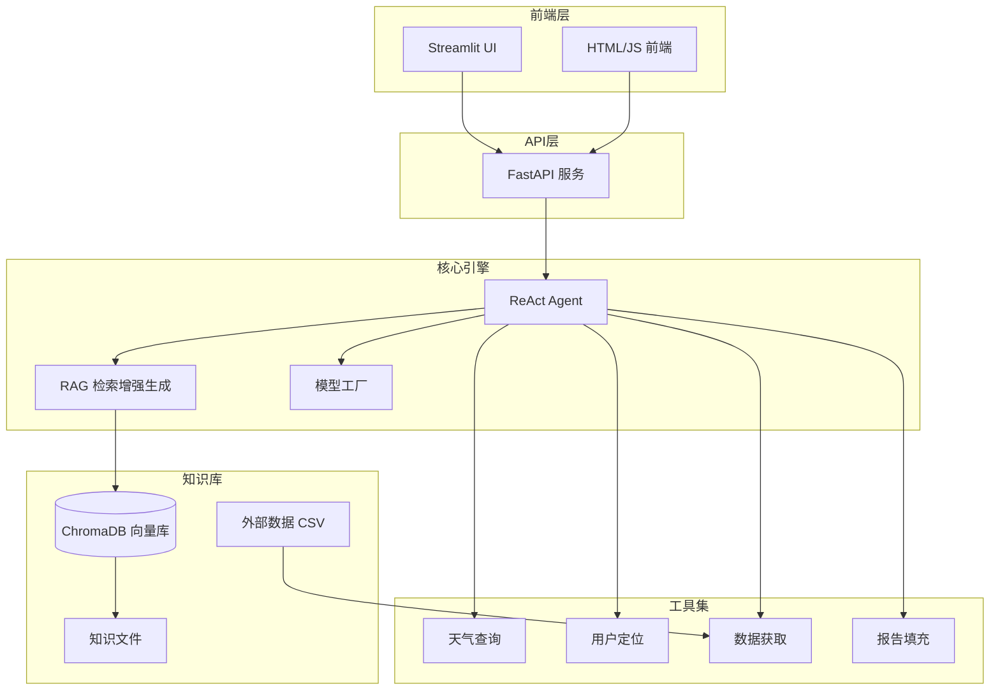
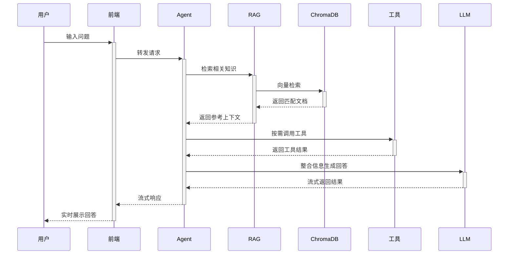

<p align="center">
  
  
  
  
  
  
</p>

<h1 align="center">智扫通机器人智能客服</h1>
<p align="center"><b>SmartSweep — 基于 LLM + RAG + Agent 的扫地机器人智能问答系统</b></p>

<p align="center">
  智能问答 · 知识检索 · 报告生成 · 多工具集成 · 流式响应
</p>

---

## 项目简介

**智扫通**是一个面向扫地机器人领域的智能客服系统，融合了**大语言模型（LLM）**、**检索增强生成（RAG）** 与**智能体（Agent）** 三大核心技术，能够根据用户问题结合知识库信息提供准确、专业的回答。

系统支持**多轮对话**、**流式输出**、**报告生成**等功能，并集成了天气查询、用户定位、外部数据获取等多种工具，为用户提供全方位的智能客服体验。

### 适用场景

- 🏠 扫地机器人 **选购咨询**（户型匹配、功能对比）
- 🔧 扫地机器人 **故障排查**（故障代码解读、解决方案）
- 📋 扫地机器人 **维护保养**（耗材更换、清洁建议）
- 📊 扫地机器人 **使用报告**（月度使用数据分析）

---

## 系统架构



### 核心流程



---

## 核心功能

### 1. 智能问答
基于 RAG 技术，从知识库中检索相关信息，结合大模型生成精准回答。

### 2. 多工具集成
| 工具 | 功能 | 说明 |
|------|------|------|
| `rag_summarize` | RAG 知识检索 | 从向量库检索扫地机器人相关资料 |
| `get_weather` | 天气查询 | 获取指定城市天气信息 |
| `get_user_location` | 用户定位 | 获取用户所在城市 |
| `get_user_id` | 用户识别 | 获取用户 ID |
| `get_current_month` | 时间获取 | 获取当前月份 |
| `fetch_external_data` | 外部数据获取 | 从 CSV 获取用户使用记录 |
| `fill_context_for_report` | 报告上下文填充 | 触发报告场景的提示词切换 |

### 3. 流式响应
采用 SSE（Server-Sent Events）协议，实现逐字输出效果，提升交互体验。

### 4. 报告生成
系统能根据用户的扫地机器人使用记录（特征、效率、耗材、对比等维度），自动生成使用报告。

### 5. 双模式部署
- **Streamlit 模式**：快速启动，适合演示与调试
- **FastAPI 模式**：RESTful API，支持自定义前端，适合生产部署

---

## 技术栈

| 层级 | 技术 | 说明 |
|------|------|------|
| 🎨 前端 | **Streamlit** / **HTML + JavaScript** | 交互界面与可视化 |
| ⚙️ 后端 | **Python 3.10+** | 核心业务逻辑 |
| 🧠 大模型 | **通义千问 (Qwen-Max)** | 自然语言理解与生成 |
| 🧩 智能体框架 | **LangChain ReAct** | 智能体推理与工具调用 |
| 📚 向量数据库 | **ChromaDB** | 知识库存储与语义检索 |
| 🔗 文本嵌入 | **text-embedding-v4** | 文本向量化 |
| 🌐 API 服务 | **FastAPI + Uvicorn** | RESTful 接口与流式响应 |
| ⚙️ 配置管理 | **YAML** | 模块化参数配置 |

---

## 快速开始

### 环境要求

- Python 3.10+
- pip 21.0+
- 通义千问 API 密钥

### 1. 克隆项目

```bash
git clone <repository-url>
cd AI大模型RAG与智能体开发_Agent项目
```

### 2. 安装依赖

```bash
pip install -r requirements.txt
```

### 3. 配置 API 密钥

```bash
# Windows (CMD)
set DASHSCOPE_API_KEY=your_api_key_here

# Windows (PowerShell)
$env:DASHSCOPE_API_KEY="your_api_key_here"

# Linux / macOS
export DASHSCOPE_API_KEY=your_api_key_here
```

也可在项目根目录创建 `.env` 文件：

```env
DASHSCOPE_API_KEY=your_api_key_here
```

### 4. 配置文件说明

项目主要通过 `config/` 目录下的 YAML 文件进行配置：

| 配置文件 | 用途 | 关键参数 |
|----------|------|----------|
| `rag.yml` | RAG 模型配置 | `chat_model_name`, `embedding_model_name` |
| `agent.yml` | 智能体配置 | `external_data_path` |
| `chroma.yml` | 向量数据库配置 | `collection_name`, `k`, `chunk_size` |
| `prompts.yml` | 提示词路径配置 | 各场景 prompt 文件路径 |

---

## 使用指南

### 启动方式一：Streamlit 模式（推荐体验）

```bash
streamlit run app.py
```

访问 `http://localhost:8501`，在聊天框输入问题即可。

### 启动方式二：FastAPI 模式（生产部署）

```bash
# 方式1：命令行
uvicorn fastapi_main:app --reload --port 8001

# 方式2：直接运行
python fastapi_main.py
```

#### API 接口

| 方法 | 路径 | 说明 |
|------|------|------|
| `GET` | `/` | 返回前端聊天页面 |
| `POST` | `/chat` | 流式聊天接口（SSE） |
| `POST` | `/chat/sync` | 同步聊天接口 |
| `GET` | `/health` | 健康检查接口 |

#### 接口调用示例

```python
import requests
import json

# 流式聊天
url = "http://localhost:8001/chat"
response = requests.post(url, json={"query": "小户型适合哪些扫地机器人？"}, stream=True)

for line in response.iter_lines():
    if line:
        line = line.decode("utf-8")
        if line.startswith("data: "):
            data = json.loads(line[6:])
            print(data["content"], end="", flush=True)

# 同步聊天
url = "http://localhost:8001/chat/sync"
response = requests.post(url, json={"query": "如何保养扫地机器人？"})
print(response.json()["response"])
```

### 问答示例

```
Q: 小户型适合哪些扫地机器人？
A: 根据资料，小户型建议选择以下类型的扫地机器人：
   - 机身轻薄（<10cm），便于进入低矮家具底部
   - 尘盒容量适中（300-400ml），足以应对日常清洁
   - 支持边角清扫功能，提高覆盖率
   ...

Q: 生成我的月度使用报告
A: 为您生成2025年3月的使用报告：
   - 清扫特征：每日定时清扫，覆盖面积提升
   - 清洁效率：较上月提升15%
   - 耗材状态：边刷建议更换，滤网正常
   - 本月对比：综合评分 A
   ...
```

---

## 项目结构

```
AI大模型RAG与智能体开发_Agent项目/
├── agent/                         # 智能体模块
│   ├── react_agent.py             # ReAct 智能体核心实现
│   └── tools/                     # 工具函数
│       ├── agent_tools.py         # 工具定义（RAG/天气/定位等）
│       └── middleware.py          # 智能体中间件（监控/日志/提示词切换）
├── config/                        # 配置管理
│   ├── agent.yml                  # 智能体配置（外部数据路径）
│   ├── chroma.yml                 # 向量数据库配置（集合/分块参数）
│   ├── prompts.yml                # 提示词文件路径配置
│   └── rag.yml                    # RAG 模型配置（模型名称）
├── data/                          # 数据与知识库
│   ├── external/                  # 外部数据（CSV格式使用记录）
│   ├── 故障排除.txt                # 故障排除知识
│   ├── 维护保养.txt                # 维护保养知识
│   └── 选购指南.txt                # 选购指南知识
├── model/                         # 模型层
│   └── factory.py                 # 模型工厂（LLM + Embeddings）
├── prompts/                       # 提示词模板
│   ├── main_prompt.txt            # 主对话提示词
│   ├── rag_summarize.txt          # RAG 总结提示词
│   └── report_prompt.txt          # 报告生成提示词
├── rag/                           # 检索增强生成
│   ├── rag_service.py             # RAG 服务（检索 + 生成）
│   └── vector_store.py            # 向量存储服务（ChromaDB）
├── utils/                         # 工具模块
│   ├── config_handler.py          # YAML 配置加载
│   ├── file_handler.py            # 文件读写处理
│   ├── logger_handler.py          # 日志记录
│   ├── path_tool.py               # 路径解析
│   └── prompt_loader.py           # 提示词文件加载
├── static/                        # 静态资源
│   └── index.html                 # FastAPI 模式前端页面
├── chroma_db/                     # ChromaDB 持久化存储
├── logs/                          # 运行日志
├── app.py                         # Streamlit 应用入口
├── fastapi_main.py                # FastAPI 应用入口（含完整注释）
├── main.py                        # FastAPI 精简入口
├── requirements.txt               # 项目依赖
└── README.md                      # 项目说明
```

---

## 核心模块详解

### 1. 智能体模块 (`agent/`)

**ReAct Agent** 是系统的核心决策引擎，采用 LangChain 的 ReAct（Reasoning + Acting）模式：

- **推理**：分析用户问题，决定调用哪些工具及调用顺序
- **行动**：按序调用工具获取信息（知识检索、天气、用户数据等）
- **观察**：整合工具返回的结果
- **回答**：基于所有信息生成最终回答

**中间件机制**：
- `monitor_tool` — 工具调用监控与日志记录
- `log_before_model` — 模型调用前日志记录
- `report_prompt_switch` — 根据上下文切换提示词策略

### 2. RAG 模块 (`rag/`)

实现检索增强生成（Retrieval-Augmented Generation）流程：

```
用户问题 → 向量检索 → 获取相关文档 → 拼接上下文 → LLM生成回答
```

- **ChromaDB** 作为向量数据库，存储知识库的向量表示
- **文本嵌入模型** `text-embedding-v4` 将文本转换为向量
- 支持多种文件格式（TXT, PDF）的知识导入

### 3. 模型工厂 (`model/`)

采用工厂模式设计，统一管理模型实例：

- `ChatModelFactory` — 创建通义千问聊天模型实例
- `EmbeddingsFactory` — 创建 DashScope 文本嵌入模型实例
- 支持通过配置文件切换模型版本

---

## 知识库管理

知识库位于 `data/` 目录，支持通过增删文件扩展知识范围：

| 文件 | 内容 | 用途 |
|------|------|------|
| `故障排除.txt` | 常见故障代码及解决方案 | 故障诊断问答 |
| `维护保养.txt` | 日常维护与耗材更换指南 | 保养知识问答 |
| `选购指南.txt` | 不同户型的功能推荐 | 选购咨询 |

**扩展知识库**：在 `data/` 目录下添加 TXT 或 PDF 文件，系统会在启动时自动加载并向量化存储到 ChromaDB 中。

---

## 自定义开发

### 添加新工具

在 `agent/tools/agent_tools.py` 中通过 `@tool` 装饰器定义：

```python
from langchain_core.tools import tool

@tool(description="新工具的描述")
def my_new_tool(param: str) -> str:
    """工具实现逻辑"""
    result = do_something(param)
    return result
```

然后在 `react_agent.py` 中将工具添加到 `tools` 列表即可。

### 切换模型

修改 `config/rag.yml`：

```yaml
chat_model_name: qwen-max          # 通义千问 Max 版本
# chat_model_name: qwen-plus       # 通义千问 Plus 版本
# chat_model_name: qwen-turbo      # 通义千问 Turbo 版本

embedding_model_name: text-embedding-v4
```

---

## 许可证

本项目采用 MIT 许可证。详情请参阅 `LICENSE` 文件。

---

## 联系方式

- **维护者**：[lei44196](https://github.com/lei44196)
- **邮箱**：[2137601181@qq.com](mailto:2137601181@qq.com)
- **GitHub**：[lei44196](https://github.com/lei44196)

---

## 免责声明

本项目仅用于**学习和研究目的**，不用于商业用途。使用本项目时，请遵守相关法律法规和服务条款。

---

<p align="center">
  <b>智扫通 SmartSweep</b> · 让智能客服更智能
</p>