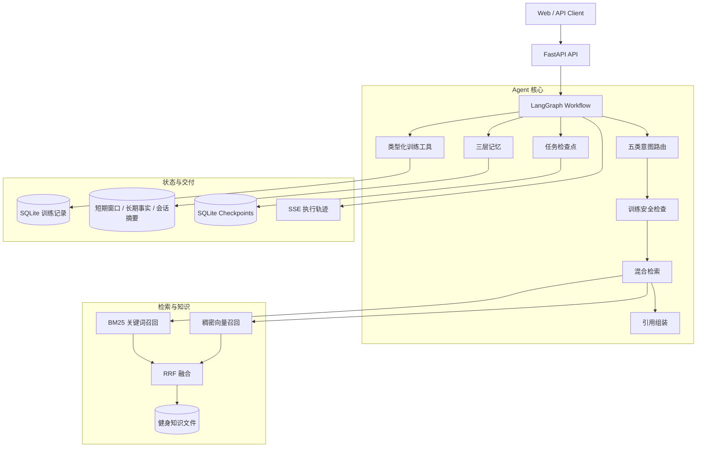
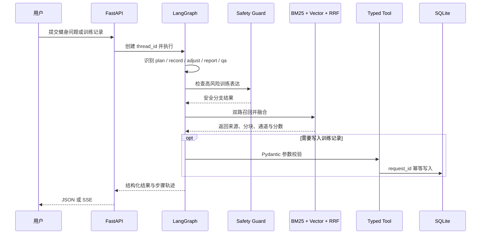

<div align="center">

# 智练通 · 健身训练 Agent

**FitFlow Agent — 面向训练计划、训练记录、动态调整与周期复盘的可靠 AI Agent**

可控路由 · 混合检索 · 三层记忆 · 幂等工具 · 任务恢复 · SSE 轨迹 · 离线评测

[](https://www.python.org/)
[](https://fastapi.tiangolo.com/)
[](https://langchain-ai.github.io/langgraph/)
[](https://github.com/youcaifang66-ops/zhiliantong-agent/actions/workflows/ci.yml)

</div>

---

## 项目简介

智练通是一个面向个人健身场景的 Agent 系统，将训练知识检索、计划生成、训练记录、动态调整和周期复盘组织成可追踪的工作流。系统不依赖一次性自由生成，而是在路由、安全检查、检索、工具写入和任务恢复等关键位置加入确定性约束。

项目以仓库内自建的动作知识、训练计划原则和安全提示为知识源。知识内容用于软件工程与 Agent 链路验证，不替代医生、物理治疗师或合格教练的个体化诊断与指导。

### 适用场景

- 🏋️ **动作问答**：查询动作要领、常见代偿和进退阶方式
- 🗓️ **训练计划**：结合目标、频率和可用时间组织训练建议
- 📝 **训练记录**：结构化保存动作、重量、组次、时长和 RPE
- 🔄 **动态调整**：根据疲劳、完成度和动作质量给出调整路径
- 📊 **周期复盘**：按月汇总训练量、完成情况和变化趋势

---

## 系统架构



### 核心流程



---

## 核心功能

### 1. 五类意图路由

在 Agent 执行前完成轻量路由，并为不同场景选择对应流程。

| 意图 | 说明 | 典型输入 |
|---|---|---|
| `plan` | 训练计划 | “帮我安排每周三练增肌计划” |
| `record` | 训练记录 | “记录今天深蹲 60 公斤 4 组” |
| `adjust` | 动态调整 | “连续两周表现下降怎么调整” |
| `report` | 周期报告 | “生成本月训练报告” |
| `qa` | 知识问答 | “俯卧撑动作标准是什么” |

### 2. 可追踪混合检索

| 通道 | 作用 | 输出证据 |
|---|---|---|
| BM25 | 捕获动作名称、症状和训练术语的精确匹配 | source、chunk_id、rank |
| 稠密字符向量 | 在无外部模型的 CI 环境中提供确定性语义近似 | source、channel、score |
| RRF | 融合不同量纲的召回结果 | fused_score、最终排名 |

生产链路可替换为 DashScope Embedding；离线评测采用确定性稠密字符向量，使结果不依赖网络或模型版本。

### 3. 三层记忆

| 层级 | 内容 | 可靠性机制 |
|---|---|---|
| 短期窗口 | 最近对话消息 | 固定窗口控制上下文长度 |
| 长期事实 | 用户目标、偏好与稳定事实 | SHA-256 精确去重、相似度去重、TTL、90 天指数衰减 |
| 会话摘要 | 压缩后的历史上下文 | 持久化保存并按需注入 |

### 4. 类型化工具与幂等写入

训练动作、重量、次数、时长和 RPE 由 Pydantic 在接口边界校验。SQLite 仓储以 `request_id` 建立唯一约束，重试同一请求不会重复生成训练记录。

### 5. 长任务恢复

任务存储单独保存当前步骤、状态、负载和重试次数。工具失败最多重试 3 次，并可从检查点恢复，避免业务数据与工作流状态互相污染。

### 6. API 与流式轨迹

| 方法 | 路径 | 功能 |
|---|---|---|
| `GET` | `/health` | 健康检查与版本信息 |
| `POST` | `/v1/training-records` | 幂等创建训练记录 |
| `GET` | `/v1/users/{user_id}/summaries/{month}` | 查询月度训练汇总 |
| `POST` | `/v1/agent/run` | 同步执行 Agent |
| `POST` | `/v1/agent/stream` | 通过 SSE 返回步骤轨迹与结果 |

---

## 离线评测

`eval/fitness_golden.json` 包含 50 条人工标注的意图与目标来源，用于固定回归测试。

| 指标 | 当前结果 | 可解释口径 |
|---|---:|---|
| 路由命中 | 50 / 50 | 固定五类意图用例 |
| Recall@1 | 45 / 50 | 首位命中目标来源 |
| Recall@3 | 49 / 50 | Top-3 命中目标来源 |
| Recall@5 | 50 / 50 | Top-5 命中目标来源 |
| MRR | 0.9417 | 首个相关来源的倒数排名 |
| NDCG@5 | 0.9565 | Top-5 排序质量 |
| 检索 P95 | 0.363 ms | 本次本地纯检索运行，不含网络与 LLM 延迟，随机器环境波动 |

> 这些结果验证固定数据上的路由与检索实现，不代表线上回答准确率、神经 Embedding 效果或医疗有效性。

复现命令：

```bash
uv sync --frozen --group dev
uv run pytest -q
uv run python eval/run_offline_eval.py
```

---

## 技术栈

| 层级 | 技术 | 用途 |
|---|---|---|
| Agent 编排 | LangGraph / LangChain | 状态流转、条件路由、线程检查点 |
| API | FastAPI / Pydantic / SSE | 类型化接口、参数校验、流式轨迹 |
| 检索 | BM25 / Dense Vector / RRF | 多路召回与融合排序 |
| 状态存储 | SQLite | 训练记录、幂等键、任务检查点 |
| 工程交付 | uv / pytest / Ruff / Docker / GitHub Actions | 依赖锁定、测试、静态检查与 CI |

---

## 快速开始

### 1. 克隆与安装

```bash
git clone https://github.com/youcaifang66-ops/zhiliantong-agent.git
cd zhiliantong-agent
uv sync --frozen --group dev
```

### 2. 启动服务

```bash
uv run uvicorn api_app:app --host 0.0.0.0 --port 8000
```

打开 `http://localhost:8000/docs` 查看 OpenAPI 文档。

### 3. 调用 Agent

```bash
curl -X POST http://localhost:8000/v1/agent/run \
  -H "Content-Type: application/json" \
  -d '{"user_id":"1001","query":"新手每周练几次"}'
```

### 4. Docker 启动

```bash
docker compose up --build
```

---

## 项目结构

```text
zhiliantong-agent/
├── agent/                  # LangGraph 工作流、意图路由、记忆与工具
├── domain/                 # 训练记录领域模型
├── infrastructure/         # SQLite 记录仓储与任务检查点
├── rag/                    # 混合检索、向量存储与 RAG 服务
├── data/                   # 健身知识、自建记录与记忆数据
├── eval/                   # 50 条固定回归集与评测脚本
├── tests/                  # API、检索、记忆、幂等与恢复测试
├── docs/                   # 架构、路线图与面试深挖文档
├── api_app.py              # v1 API 与 SSE 入口
├── Dockerfile
└── docker-compose.yml
```

## 设计文档

- [系统架构](docs/ARCHITECTURE.md)
- [十阶段迭代路线](docs/ROADMAP.md)
- [面试深挖与责任边界](docs/INTERVIEW.md)
- [最新评测结果](eval/latest_metrics.json)

## 数据与使用边界

- 健身知识和 Golden Query 均为仓库内自建数据，用于工程验证。
- 评测不包含 LLM 最终回答质量，也不构成医疗或运动处方建议。
- 外部模型和 Embedding 服务通过适配器接入，离线测试默认不访问第三方 API。

## 来源与许可

项目通过 GitHub Fork 保留上游历史，来源为 [lei44196/Aagent_zhisaotong](https://github.com/lei44196/Aagent_zhisaotong)。上游 README 声明采用 MIT License，但当前源码快照未包含 `LICENSE`；在作者补齐许可证或另行授权前，请勿用于商业分发。
