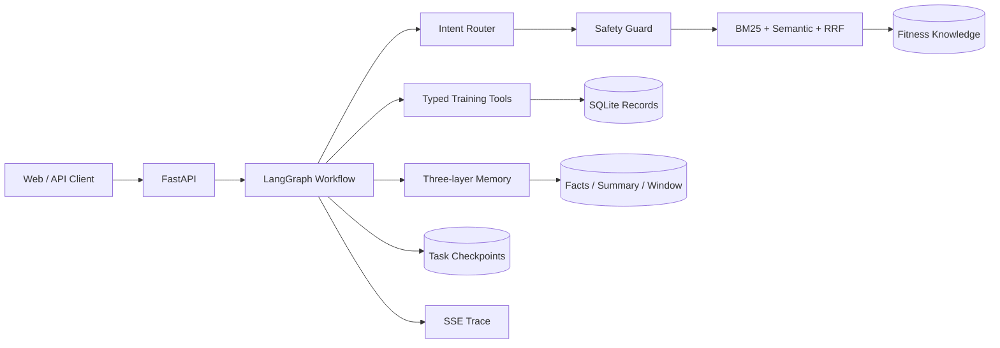

# 系统架构

```mermaid
flowchart LR
    UI[Web / API Client] --> API[FastAPI]
    API --> WF[LangGraph Workflow]
    WF --> I[Intent Router]
    I --> S[Safety Guard]
    S --> R[BM25 + Semantic + RRF]
    R --> K[(Fitness Knowledge)]
    WF --> T[Typed Training Tools]
    T --> DB[(SQLite Records)]
    WF --> M[Three-layer Memory]
    M --> MEM[(Facts / Summary / Window)]
    WF --> C[(Task Checkpoints)]
    WF --> SSE[SSE Trace]
```

请求首先经过无模型规则路由和安全检查，减少无意义的模型调用。知识问答进入双路召回，返回结构化引用。写工具通过 Pydantic 在边界校验，通过幂等键防止重试造成重复数据。长任务状态与业务记录分开存储，便于恢复和审计。

外部 LLM 与 Embedding 服务属于可替换适配器；核心仓储、记忆、路由、检索评测和安全分支均可离线测试。
